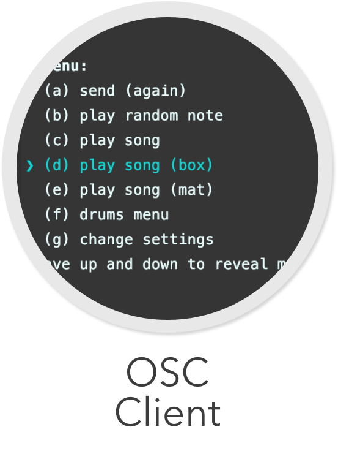

<div align="center">
    
</div>

# Terminal-Client

This project contains an OSC-Client implemented with NodeJS and used on the 
terminal

## Getting started

Install all the dependencies with
```
npm install
```

Then you can start client with
```
npm run start
```

## Usage
If the client is started the first time you will be prompted to 
enter an osc path:
```
? Enter OSC-Path:  
```
for example use: /play_note

The next thing you should enter is a minimum of one argument:
```
? Enter OSC-args (format: "type,value):
```
for example use: 
```
1. s,C4    // string,note
2. s,8n    // string,duration 
3. f,1     // float,velocity between 0 and 1
```

After that the Client creates the following output:
```
{
  "port": 57121,              // port of the osc-server
  "address": "46.101.238.70", // ip-address of the osc-server
  "path": "/play_note",       // path of the osc message
  "args": [                   // arguments
    {
      "type": "s",
      "value": "C4"
    },
    {
      "type": "s",
      "value": "8n"
    },
    {
      "type": "f",
      "value": 1
    }
  ],
  "url": "mcp-dev.miguel-franken.com"
}
? Menu: (Use arrow keys)
> (a) send (again)
  (b) play random note
  (c) play song
  (d) drums menu
  (e) change settings
  exit
```

With the arrow keys you can go up and down the menu.

### Standard Menu

Pressing Enter on:
<table style="width:100%;text-align:left;">
<tr>
<th style="min-width:250px;">

```
> (a) send (again)
```
</th>
<th>Sends the current configuratione statet in the object seen above the menu</th></tr><tr><th>

```
> (b) play random note
```
</th><th>plays a hardcoded note</th></tr>
<tr><th>

```
> (c) play song
```
</th><th>plays a hardcoded number of nodes with a 300ms delay between them</th></tr>
<tr><th>

```
> (d) drums menu
```
</th><th>opens the drum menu</th></tr>
<tr><th>

```
> (e) change settings
```
</th><th>opens the settings menu</th></tr>
</table>

### Drum Menu
Pressing Enter on:
<table style="width:100%;text-align:left;">
<tr>
<th style="min-width:300px;">

```
> (a) starts a drum loop 
```
</th>
<th>Starts a drum loop of hardcoded drum messages with 350ms between each beat</th></tr><tr><th>

```
> (b) stops the running drum Loop
```
</th><th>stops the current running drum loop after the current loop</th></tr>
<tr><th>

```
> back
```
</th><th>goes back to the standard menu</th></tr>
</table>

### Settings menu
Pressing Enter on:
<table style="width:100%;text-align:left;">
<tr>
<th style="min-width:300px;">

```
> (a) change osc path 
```
</th>
<th>the user gets asked to enter the new path</th></tr><tr><th>

```
> (b) change osc args
```
</th><th>the user gets asked to enter new arguments. after each argument you can decided if you want to enter another argument (press Enter or enter Y and press Enter) or if there are enough arguments (enter n and press enter). all arguments listed before in the object get deleted</th></tr>
<tr><th>

```
> (c) change address
```
</th><th>enter the new ip adress of the osc-server. The user can enter a url, then the client will process a dns-lookup.</th></tr>
<tr><th>

```
> (d) change port
```
</th><th>the user gets asked to enter a new port</th></tr>
<tr><th>

```
> back
```
</th><th>goes back to the standard menu</th></tr>
</table>


### Restarting the Client
In the folder dist you find the file oscconfig.json.
In this file the client saves the last connection object.
If you delete this file the client handles his start as its the first time ever.
The file gets loaded at the start of the client and saved if you press exit.
While the client is open the file will not be updatet and if you close the programm
not with the exit button the saving-process is not initiated.
