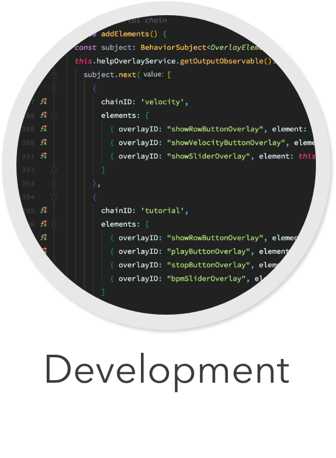

<div align="center">
  
</div>

[Back](../../README.md)

# Development
The following introduces you to setting up *The Mix* in general and adding new instruments.

If you want to deploy the project on a [Raspberry Pi], read [DEPLOYMENT.md](Documentation/development/DEPLOYMENT.md).

## Table of Contents
- [Getting Started](#switch-instrument)
- [Developing](#velocity)
  * [Technologies](#technologies)
  * [Architecture](#architecture)
- [Shrinking & Folding](#shrinking-folding)
- [Adding an Instrument](#adding-an-instrument)
  * [Creating an Instrument](#creating-an-instrument)
  * [Creating a Controller](#creating-a-controller)
- [Documentation Generation](#documentation-generation)

## Getting Started
You need [Node.js] (at least version 12.13.0).

```shell script
# Install all the dependencies with
npm install

# Then you can start the server and the frontend with
npm run start
```

Look at the console output to determine the URLs that you can connect to:
```
[Server] [2020-02-04T13:11:29.215Z]: [UDP] Started listening for OSC messages at 192.168.0.59:57121
```
In the example, the instruments can send OSC messages via UDP to `192.168.0.59:57121`.

## Developing
In development, you might want to have everything running in the background and recompile automatically whenever you save a file. To achieve that, run
```
npm run watch
```

### Technologies
- "[TypeScript] is a typed superset of JavaScript that compiles to plain JavaScript"
- The project uses [Tone.js] ([API reference](https://tonejs.github.io/docs/14.4.79/Tone)) for producing sounds (audio synthesis).
- The frontend is written using [Angular].
- The [Open Sound Control (OSC)](http://opensoundcontrol.org/introduction-osc) protocol is used for messages.
- [WebRTC] for real-time communication between server and GUI
- [SocketIO] is used to establish a WebRTC between server and GUI (exchanging signaling messages over sockets)
- [Angular Material] components are used in the GUI
- [Headless Chromium] is used to start the Chrome browser in a headless environment on the Raspberry Pi

[Node.js]: https://nodejs.org/en/
[Tone.js]: https://tonejs.github.io/
[Angular]: https://angular.io/
[WebRTC]: https://developer.mozilla.org/en-US/docs/Web/API/WebRTC_API
[SocketIO]: https://socket.io/
[Angular Material]: https://material.angular.io/
[Headless Chromium]: https://developers.google.com/web/updates/2017/04/headless-chrome
[TypeScript]: https://www.typescriptlang.org/
[Raspberry Pi]: https://www.raspberrypi.org/

### Architecture
Tone.js runs in the browser. Unfortunately, the browser cannot listen for incoming UDP messages which we use to communicate with the instruments. Therefore, we need to have a server that listens for incoming UDP messages and forwards them to the GUI (or multiple connected GUIs).
The GUI will connect to the server over WebRTC. This allows real-time communication between the server and the GUI. A peer-to-peer connection is established between the GUI and the server and messages can potentially be exchanged bidirectionally via UDP (over WebRTC).


## Adding an Instrument
If you want to add an instrument, you first need to create a class that uses Tone.js to produce sounds. Then you can add a controller that can listen for messages and drive the instrument.

### Creating an Instrument
The instruments live in `Frontend/src/app/generator/library/instruments`. Simply create a new file with a class that implements `IMCPInstrument`. You can use the existing instruments as blueprints.

### Creating a Controller
The controllers are in `Frontend/src/app/generator/library/controllers`.

Use the decorators (`@Controller`, `@OnMessage`, `@Message`) to determine which path will be mapped to which method. Inside the method, you can extract the parameters from the OSC message and call the corresponding method on the instrument. The `@Controller` decorator sets the root route for the controller. Each `@OnMessage` defines a subroute which will call the method. The `@Message` decorator is used to simplify handling of OSC messages and is placed before the parameter.

You can use other controllers as a blueprint. Note that the `MusicService` in the constructor will be passed in automatically via a [dependency injection](https://www.freecodecamp.org/news/a-quick-intro-to-dependency-injection-what-it-is-and-when-to-use-it-7578c84fa88f/) mechanism. It makes it easier to have a single music service for everything and access it conveniently.

Do not forget to register your new controller in `Frontend/src/app/generator/library/controllers/index.ts`, or it will not be initialized!

## Documentation Generation
The API documentation can be found at [API.md](Documentation/API.md). It is generated automatically from the doc comments with a custom annotation syntax.

To add your controller to the documentation, simply add such comments to your controller. Use the existing controllers as a reference.

You can generate an updated [API.md](Documentation/API.md) by calling
```
node Documentation/buildDocs.js
```
