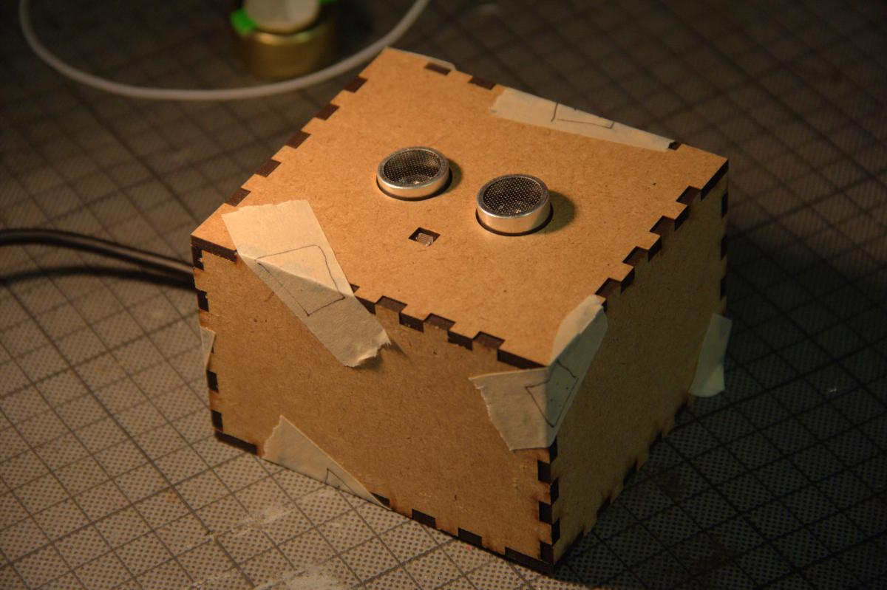
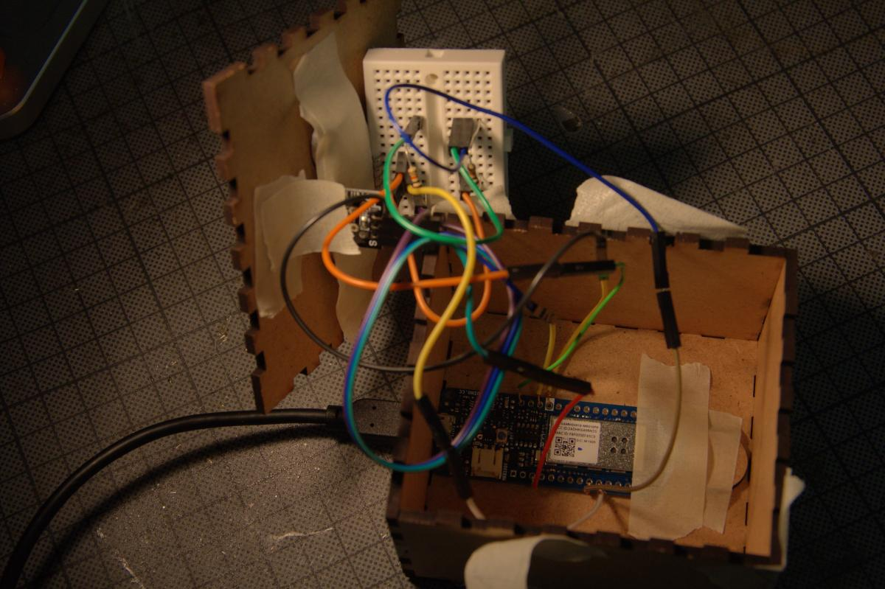
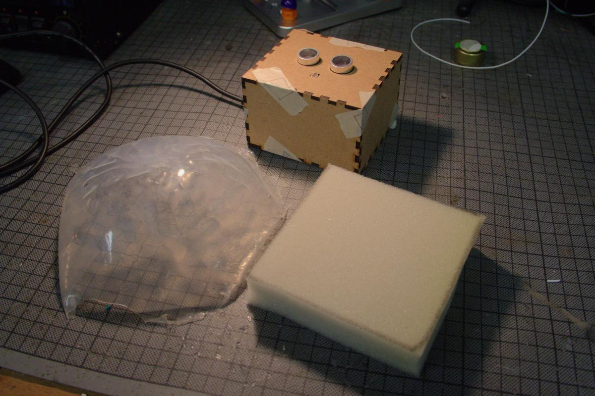

# Effectcontroller
We attempted to create a hardware effect controller that could be given to the audience to influence the music through effects. Unfortunately, the original idea failed, so we only have a simple controller. This document describes how it is made.

## Original idea
We imagined the controller to combine a light and an ultrasound sensor in a way that would couple them together in an interesting way. Since ultrasound will bounce of off transparent object, but the light sensor will not detect them, the idea was to put the two sensors together under a transparent silicone dome.

Participants could then lay they hands around the dome to block light and activate the light sensor, without influencing the ultrasound sensor. By pushing the dome down with a finger, virtually no light would be blocked, but the ultrasound sensor would pick up the depression of the dome. This would motivate coordination between multiple people to block light together and push the dome in a way that fits the music.

Unforunately, the attempts to create such a dome failed. Using a cut-open plastic football almost worked. It was white, but enough light came through to have the desired effect. When pressed, though, it would stay deflated and not bounce back, rendering it unusable.

Since using the ball as a mold for a silicone dome would have used a lot of time and silicone, we tried to reduce the waste by attempting to reinforce the ball with a layer of silicone. The first layer was much too thin and did not have any effect. The second attempt was to create "pipes" in an X shape that would be thicker and reinforce the ball from the inside. However, the mold leaked and created a flat puddle, negating any desired effect.

## Current prototype

Due to time restrictions, the original idea of the dome was abandoned. The core idea of combining a light and an ultrasound sensor is present in the prototype, however.

Both sensors are connected to the Arduino as specified in the Fritzing schematic located at `./effectcontroller-schematic.fzz`. The code to load onto the Arduino is `./effectcontroller-code.ino`. The vector file for the laser-cut box is `./effectcontroller-box.svg`.

We use an [Arduino MKR1000](https://store.arduino.cc/arduino-mkr1000-wifi) for its built-in WiFi module. We based our prototype on the documentation for the [ultrasound sensor](https://www.instructables.com/id/Simple-Arduino-and-HC-SR04-Example/) and the [light sensor](https://asset.conrad.com/media10/add/160267/c1/-/en/001485310DS01/datenblatt-1485310-iduino-se012-lichtwiderstand-1-st-5-vdc.pdf).

After all this evolution the poor prototype has gone through, don't forget to patch up all its wounds with some masking tape styled to look like plasters, to prevent it from falling apart too easily.

A silicone jellyfish (remnant from the first attempt at reinforcing the football) can be used to trigger only the light sensor. The sponge block, on the other hand, will eat up any ultrasound waves that hit it. So it is "invisible" to the ultrasound sensor, but will block light.