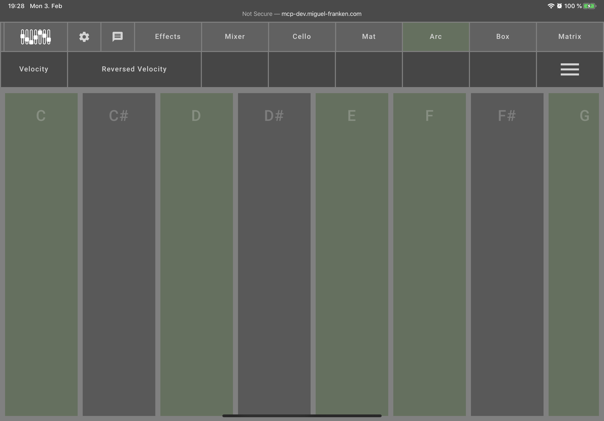

[README](../../../README.md) | [Back](Documentation/gui/INSTRUMENT_CONFIGURATIONS.md)

# Arc

The Arc configuration does not allow to test the instrument. It does however allow configuration of what notes are activated and how the velocity works.

If you find yourself playing certain notes on accident, you can deactivate them. Simply click on the notes you want to disable. You can reactivate them by clicking them again.

You can disable whether the instrument reacts to the distance of your hand to the sensors with changing the velocity, i.e. roughly, the volume, of the instrument with the "Velocity" option at the top left.

By default, holding your hand closer to the sensor plays it louder. If you want to have it play quieter the closer you are, you can reverse this behavior with "Reverse Velocity".
