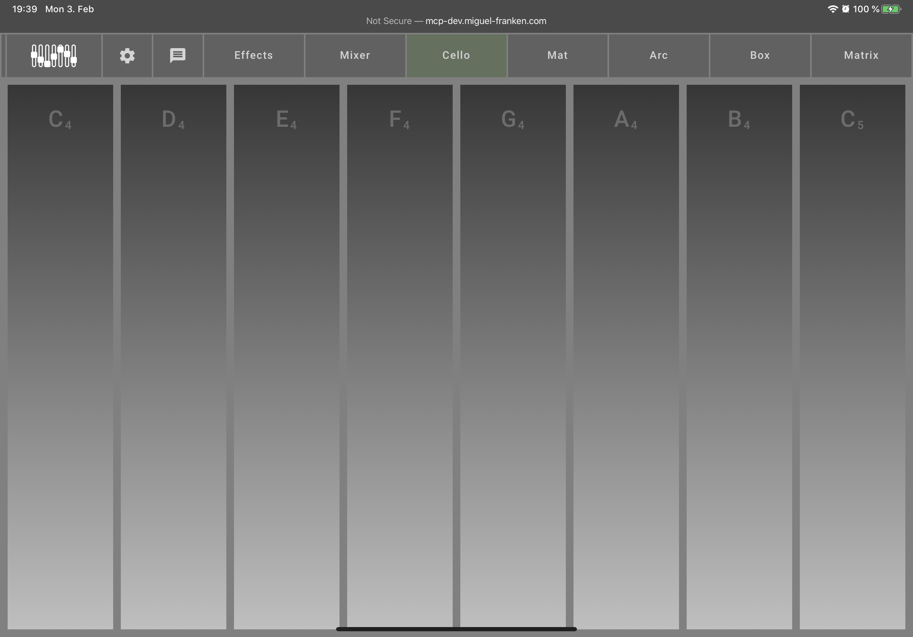

[README](../../../README.md) | [Back](LOCAL_INSTRUMENTS.md)

# Cello

The cello offers an alternative, local instrument to the Matrix. Use it by hovering over or touching the bars, representing different notes. The higher parts of the bar play the sound more loudly, the lower parts more softly. You can play multiple sounds at the same time (though this is easier with touch than with a single mouse).
