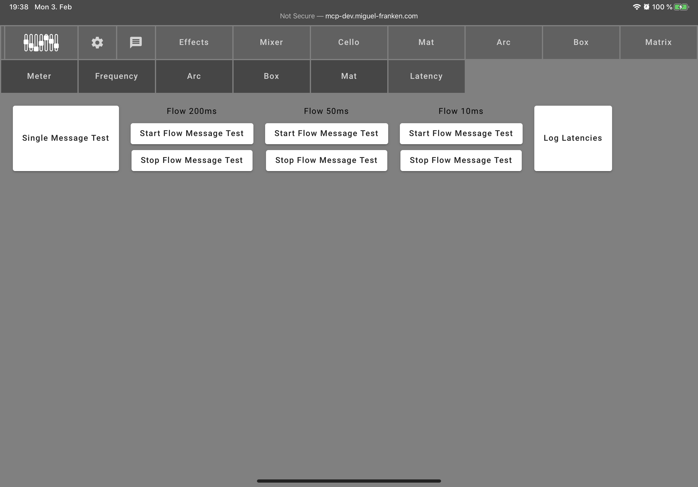

[README](../../../README.md) | [Back](gui.md)

# Experiments

The experiments are early or unpolished tests that still might provide some use.

- Meter: A meter showing the Matrix's drum's volume.
- Frequency: Plays a frequency and visualizes the waveform.
- Arc, Box, Mat: GUIs to test the instruments.
- Latency: A setup to test the latency of sending and receiving messages between the GUI and the server.
