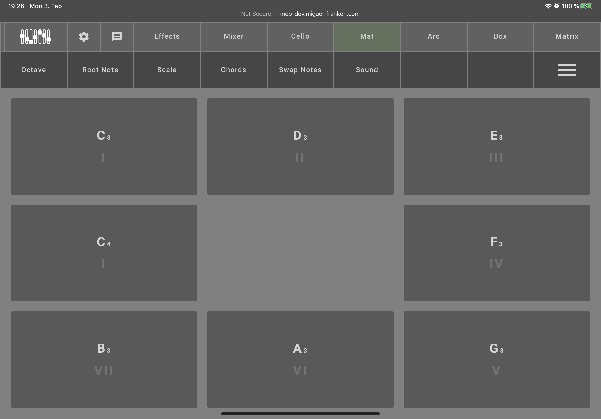
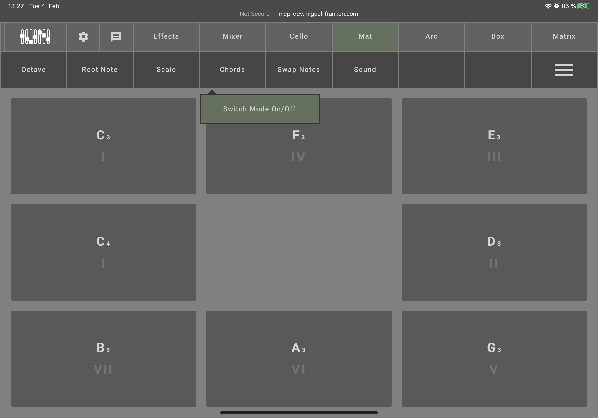
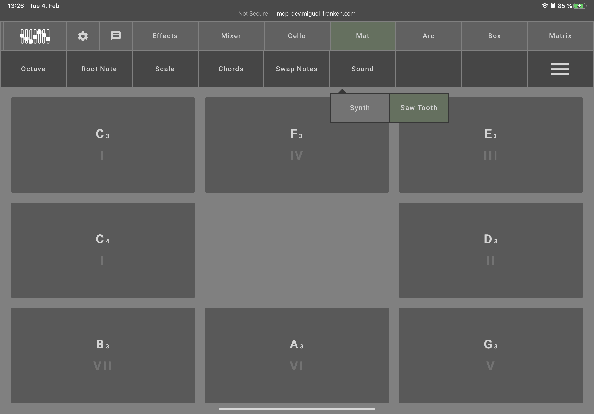
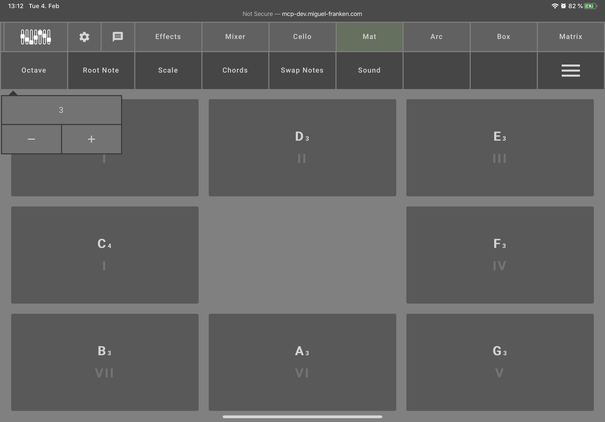
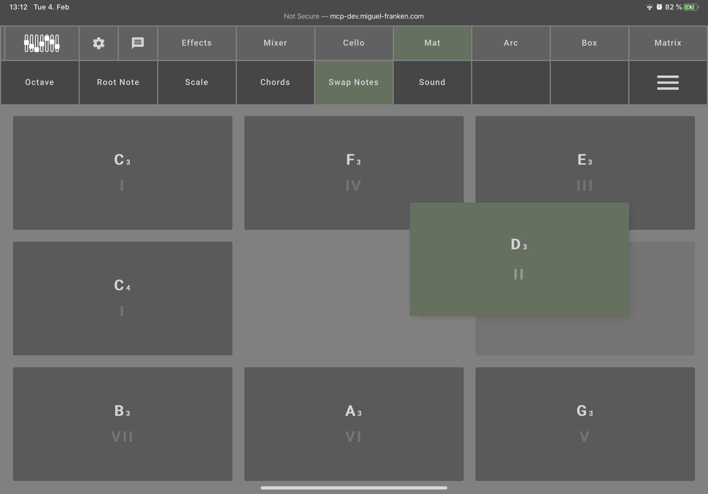
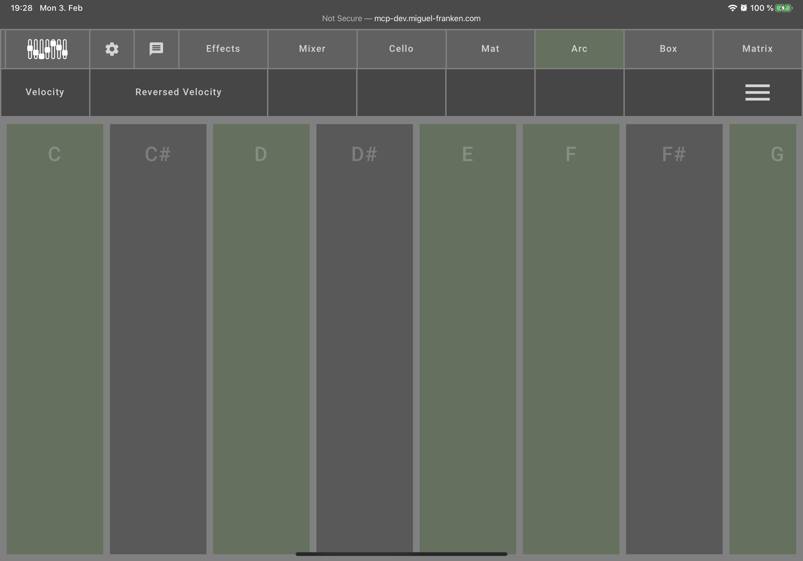
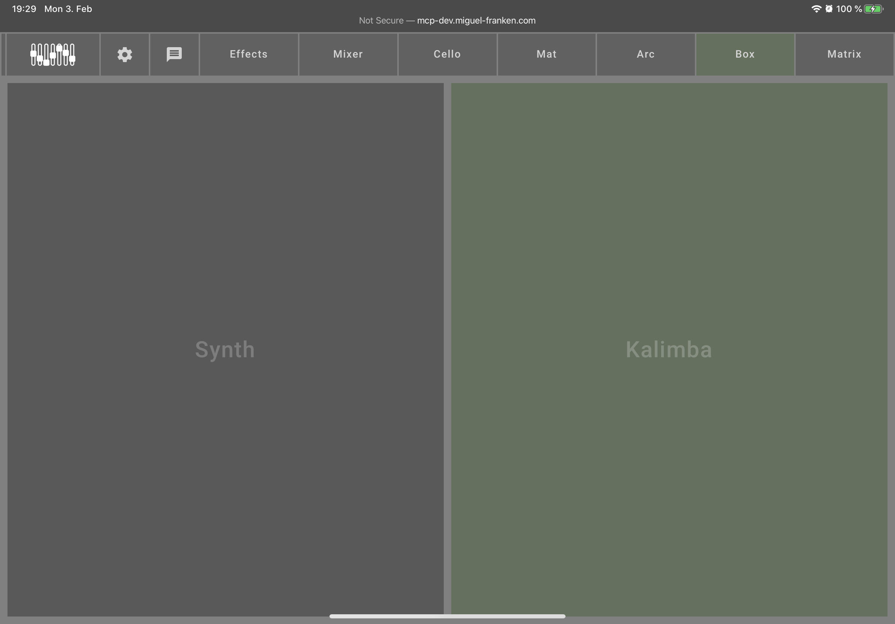

[README](../../../README.md) | [Back](Documentation/gui/GUI.md)

# Instrument configurations
## Mat

The Mat configuration allows you to test the Matrix by pressing on the different buttons.

### Chord

To influence the sound of the Mat, you can activate the "Chords" mode. Instead of one note per button, it will play an entire chord when a button is pressed. The chord will match the root note and scale settings.

### Select the synthesizer

You can also choose between different synthesizers with the "Sound" option.

### Configuration options

There are configuration options for settings what buttons play what notes.
The buttons in the GUI correspond to the buttons on the instrument.
You can shift the octave of the notes with "Octave" setting.
You can change the "Root Note" which will update the buttons with a new scale of notes fitting each other, starting at that root note.
The "Scale" option lets you switch the chord quality between major and minor.

### Swap Notes

You can also rearrange what sounds get played by each button by activating "Swap Notes" from the menu. Then you can drag and drop the notes around to rearrange the mapping of buttons' notes.

## Arc

The Arc configuration does not allow to test the instrument. It does however allow configuration of what notes are activated and how the velocity works.

If you find yourself playing certain notes on accident, you can deactivate them. Simply click on the notes you want to disable. You can reactivate them by clicking them again.

You can disable whether the instrument reacts to the distance of your hand to the sensors with changing the velocity, i.e. roughly, the volume, of the instrument with the "Velocity" option at the top left.

By default, holding your hand closer to the sensor plays it louder. If you want to have it play quieter the closer you are, you can reverse this behavior with "Reverse Velocity".

## Box

The Box simply offers a choice between different synthesizers.
