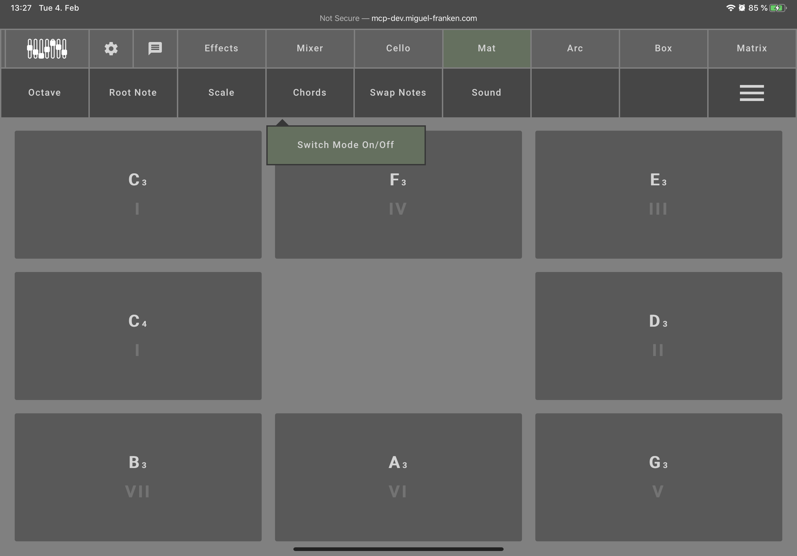
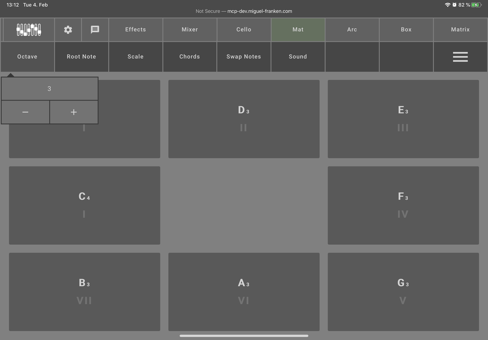
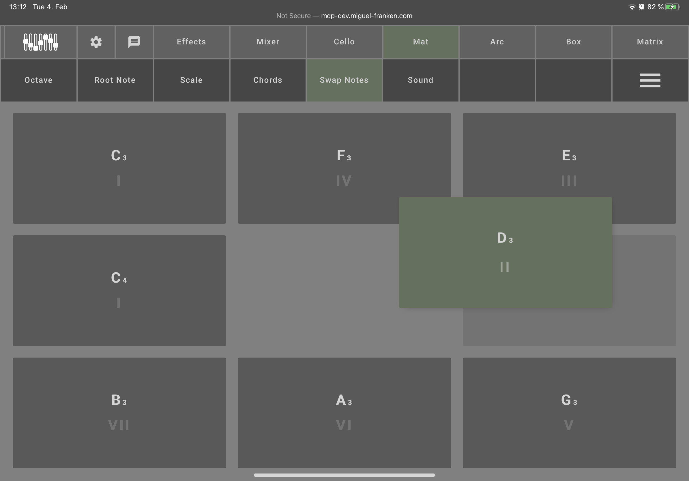

[README](../../../README.md) | [Back](Documentation/gui/INSTRUMENT_CONFIGURATIONS.md)

# Mat
The Mat configuration allows you to test the Matrix by pressing on the different buttons.

## Table of contents
- [Chord Mode](#chord-mode)
- [Sound Selection](#sound-selection)
- [Configuration Options](#configuration-options)
- [Swapping Notes](#swapping-notes)

## Chord Mode

To influence the sound of the Mat, you can activate the "Chords" mode. Instead of one note per button, it will play an entire chord when a button is pressed. The chord will match the root note and scale settings.

## Sound Selection

You can also choose between different synthesizers with the "Sound" option.

## Configuration Options

There are configuration options for settings what buttons play what notes.
The buttons in the GUI correspond to the buttons on the instrument.
You can shift the octave of the notes with "Octave" setting.
You can change the "Root Note" which will update the buttons with a new scale of notes fitting each other, starting at that root note.
The "Scale" option lets you switch the chord quality between major and minor.

## Swapping Notes

You can also rearrange what sounds get played by each button by activating "Swap Notes" from the menu. Then you can drag and drop the notes around to rearrange the mapping of buttons' notes.
