[README](../../../README.md) | [Back](LOCAL_INSTRUMENTS.md)

# Matrix
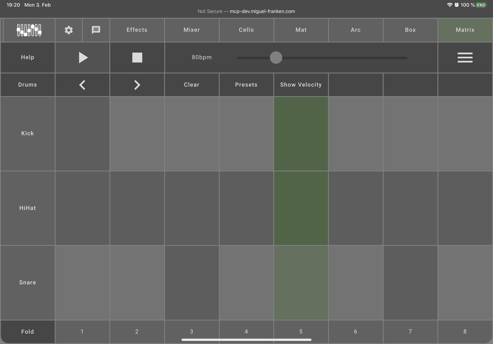

The simplest place to try out *The Mix* is the Matrix.

The basic idea is that you can place notes on the Matrix by clicking on its cells. Active cells turn a different color. From left to right, notes will be played after each other. Each row represents a different tone. By default, drums are selected and each row represents one piece of a drum kit. Once you have placed some notes, click the play button in the top left.

To the right of these arrows is a button to clear the currently set notes, a button to select a preset arrangement of notes, and a button to show the velocity settings.

You can influence the playback speed by dragging the beats per minute (BPM) slider at the middle top of the menu. Higher values play faster, lower values more slowly.

The right-most "menu"-style button will hide *The Mix* navigation and bring it back. Use this to immerse yourself in your Matrix of sounds.

## Table of contents
- [Switch Instrument](#switch-instrument)
- [Velocity](#velocity)
- [Shrinking & Folding](#shrinking-folding)

## Switch Instrument
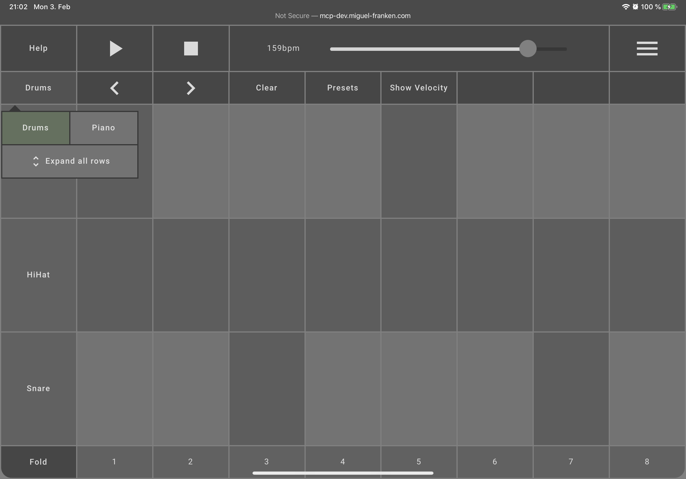

You can switch between the drums and the piano by clicking on the arrow buttons in the second menu row, or by clicking the button to their left that shows what instrument is currently selected.

## Velocity
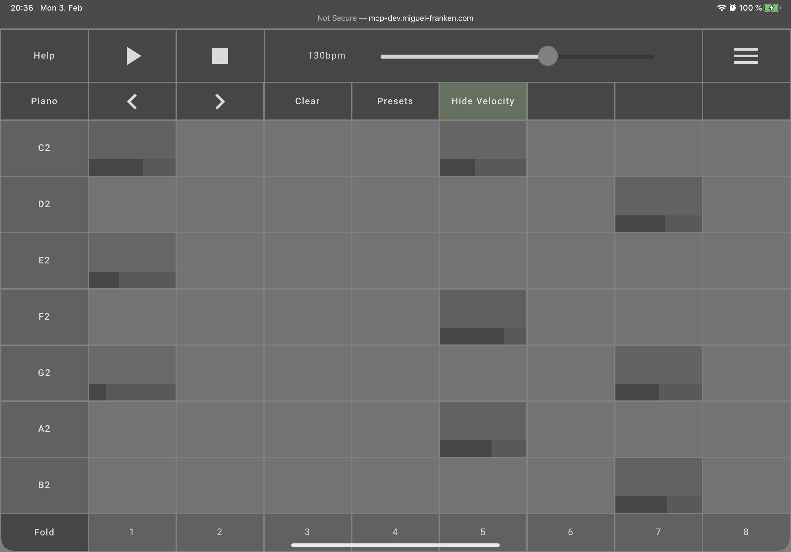

The velocity basically determines the volume of an individual note. 
By showing the velocity, a horizontal bar will appear on the bottom of activated notes. Dragging this bar to the left lowers the note's volume, dragging it to the right increases it.
As usual for music programs that have similar representations, the background of a note is displayed according to its velocity. Notes with a higher velocity have a higher alpha value, while notes with a lower velocity have a lower alpha value, resulting in a more transparent background.
This signifier makes it easy to see in the matrix which notes are played very loud and which are not.

To get an interactive tutorial, activate the velocity tutorial via the corresponding menu button in the top left:
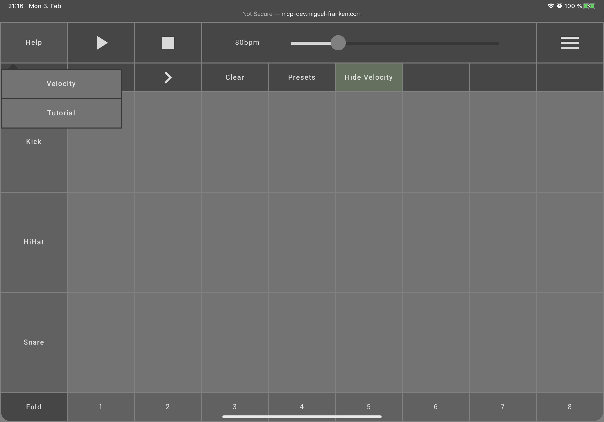
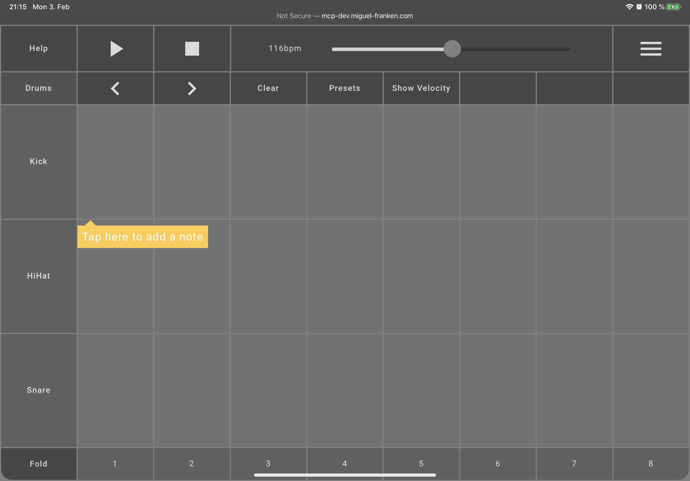
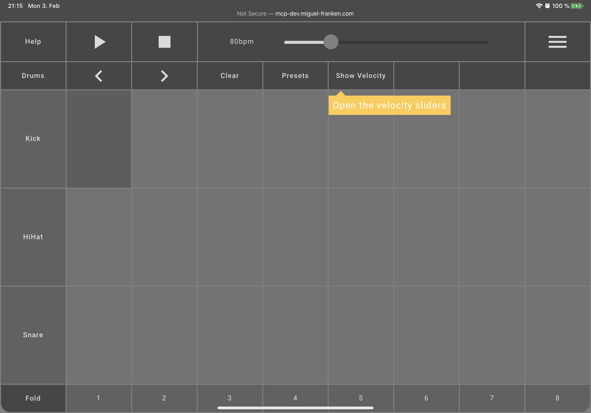
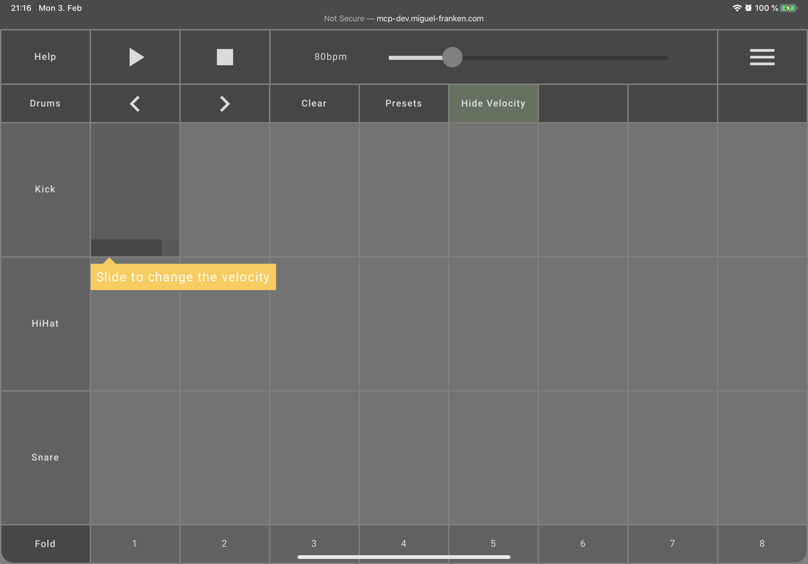
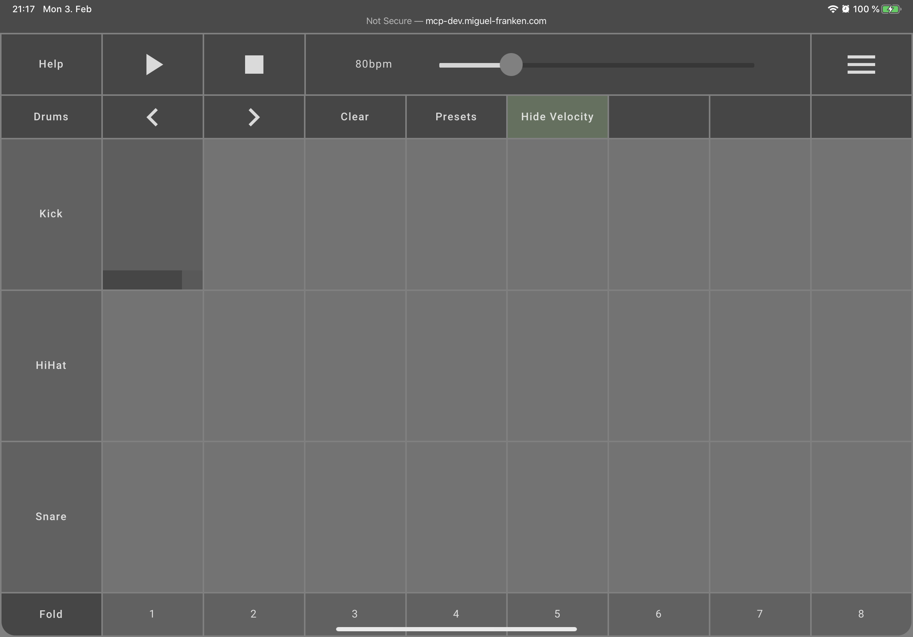

## Shrinking & Folding
While the drum instrument at this time has only 3 different percussion elements, the piano instrument has many possible notes that can be selected in the matrix.
This means that the matrix has more rows that allow input. The user must scroll vertically to see all the rows. 

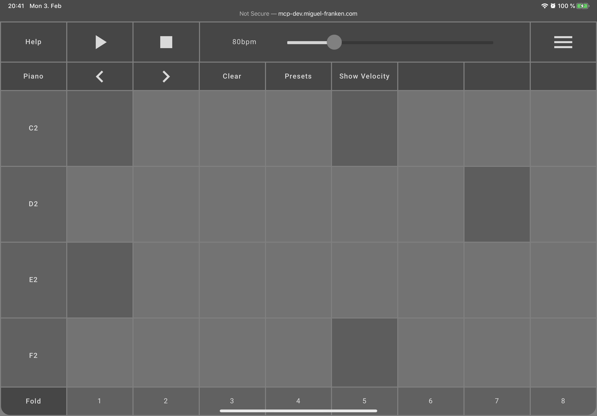

For a better overview, the height of the rows can be reduced, so that more rows can be viewed at once in the matrix.
To activate the compact matrix mode, the shrink button in the instrument menu must be pressed.

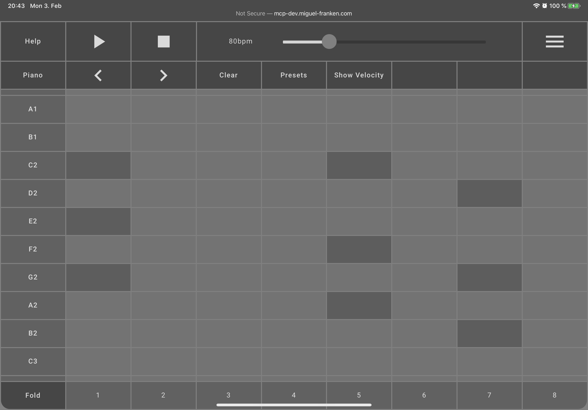

You can also choose to display only the rows in which a note is played. The fold mode can be activated by pressing the button in the lower left corner of the matrix. This view is especially useful for making subsequent changes to the velocity of individual notes that have already been defined. 

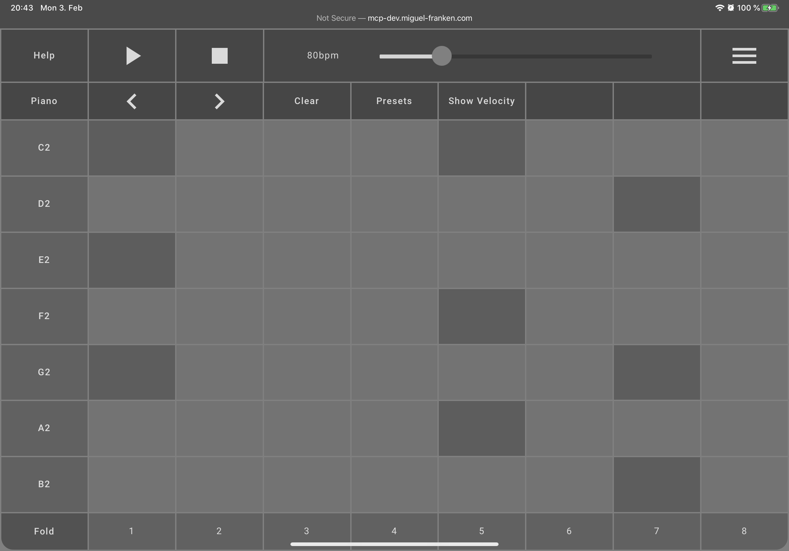
