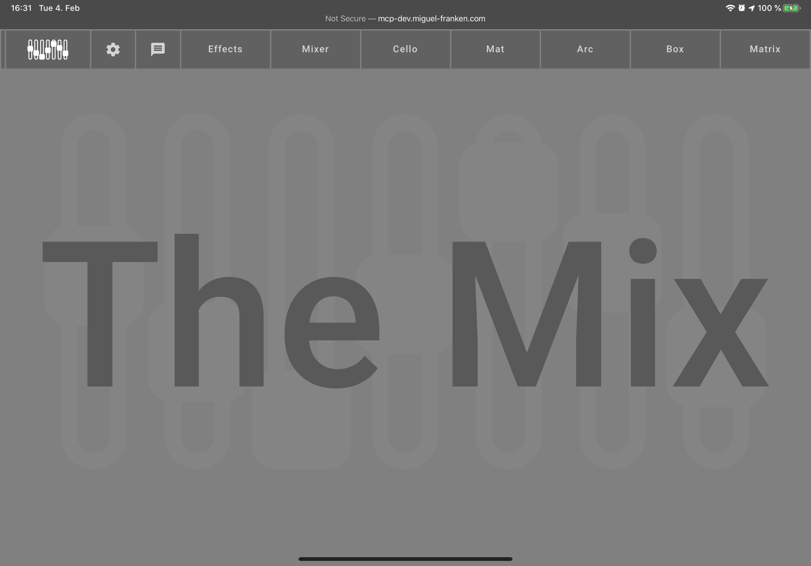

[README](../../../README.md) | [Back](Documentation/gui/GUI.md)

# Overview

At the top of the GUI is the navigation panel. It offers the following elements (from left to right):

- *Message bubble*: Flashes when incoming OSC messages are detected.
- *Logo*: Link to logo page (default page when first opened). It offers no interactive features.
- *Cog wheel*: Opens the [settings](SETTINGS.md) menu.
- [Effects](EFFECT_CONTROLS.md): Effect settings and volume meters for each instruments and the master output.
- [Mixer](EFFECT_CONTROLS.md): Volume settings for each instrument and master.
- [Cello](CELLO.md): A simple instrument.
- [Mat](MAT.md), [Arc](ARC.md), [Box](BOX.md): Configuration controls for the FabBand instruments.
- [Matrix](MATRIX.md): A simple, looping instrument.

