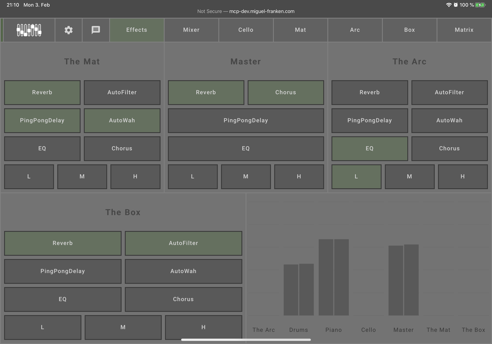
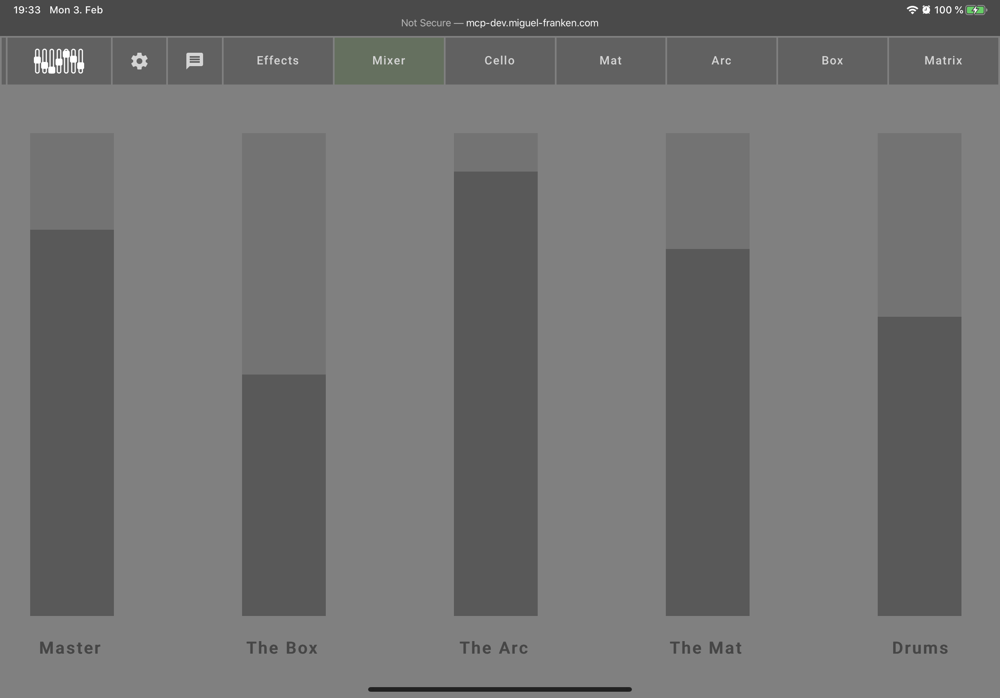

## Effect controls
### Effects

This page allows you to control the effects set for each of the instruments as well as the master output.

- Reverb: Makes the sound reverberate like in a cathedral.
- PingPongDelay: Have the sound echo side-to-side in the left and right speakers.
- AutoFilter: Adds a pulsating feel to the sound.
- AutoWah: Makes it sound like your holding your mouth over the speaker while saying "Wah".
- Chorus: Makes it sound like there is more than one instrument playing at the same time.
- EQ: Allows you to cut off low (L), medium (M), and high (H) frequencies, by first activating the EQ effect and then disabling chosen frequencies.

In addition to the effects, the bottom right shows the volume meters for each instrument as well as the master channel. This enables you to judge how loud the different instruments are in relation to each other. It can also be useful when a note hangs to determine which instrument is producing the note.

### Mixer

The mixer allows you to set the volume levels of the different instruments and the master channel. Dragging a bar lower will decrease the volume for that instrument.
