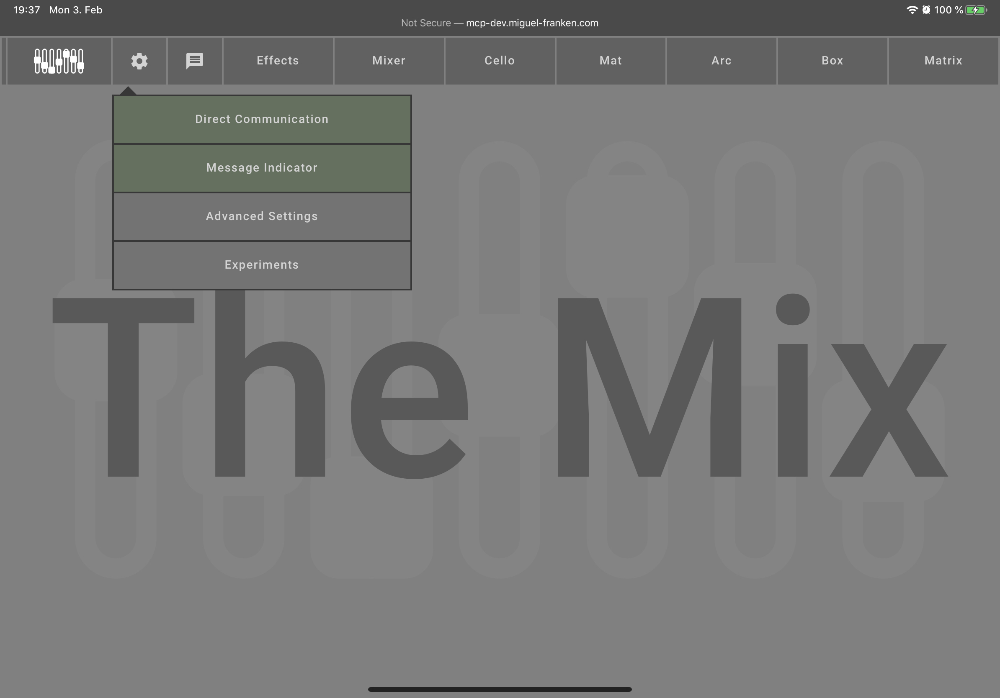
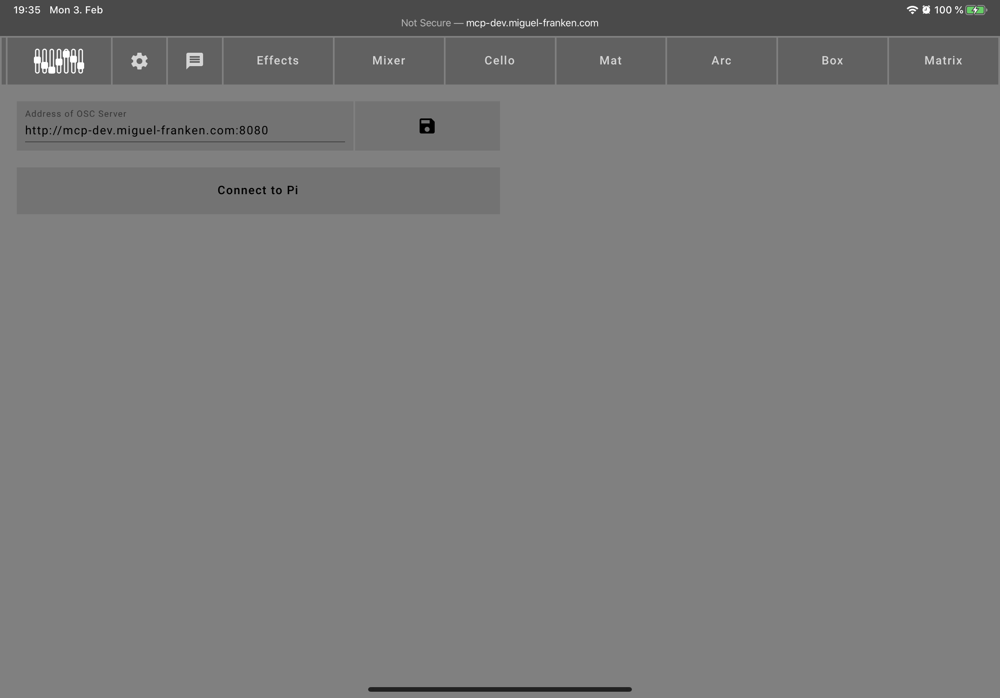

## Settings

- Direct Communication: Activates and deactivates [direct communication](#direct-communication).
- Message indicator: Toggles whether the indicator bar at the top left that flashes when a new message comes in is displayed or not. Hiding this element could slightly improve the audio synthesis performance.
- Advanced settings: Takes you to the [advanced settings](#advaned-settings) page.
- Experiments: Takes you to the [experiments](#experiments) page.

### Direct communication
Be aware that to combat latency the Mix will by default use direct communication, i.e., it will not send messages to the server, but pass the messages directly to the Mix's sound generator. This means that when you connect to the Mix with another device, you will not hear those sounds, because it will not receive them from the server as they are not sent to the server at all.

If you want to hear those sounds in another GUI, you can ask the Mix to send all messages to server by disabling "Direct communication" in the [settings](#settings). Then, other Mix GUIs will receive these messages from the server they are connected to.

### Advanced settings

The advanced settings allow you to set the address of the message server that this GUI will connect to.
By default, it assumes that it runs on the same machine as the server, thus it connects to `localhost`.
Alternatively, by entering an address and pressing the save button, a connection to another server can be established. This is especially helpful for the further development of The Mix.

If you want to connect to a server running on a Pi with the standard settings, simply click the "Connect to Pi" button to have it set automatically.
