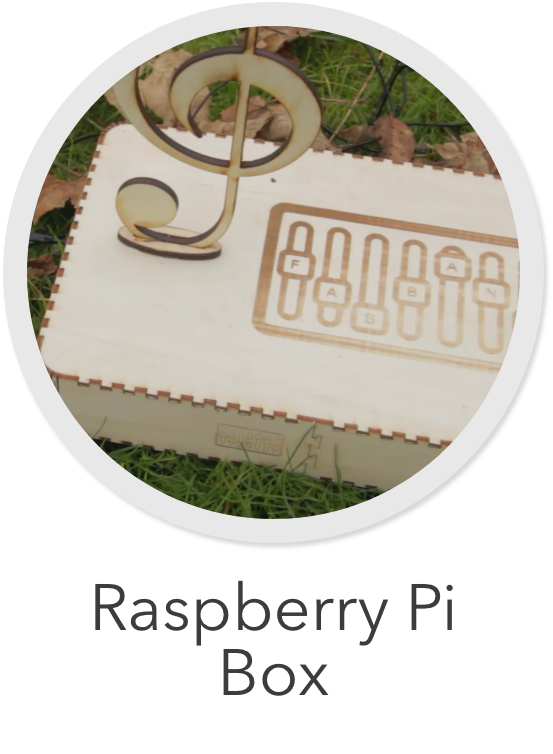

    

[Back](../../README.md)

# Raspberry Pi Box

## Building
The files for building the case for the Raspberry Pi are located at `Hardware/Pi/Case/`. Use these to cut wood in a laser cutter. You might need to emery the endings to ensure a good fit.

## Images

