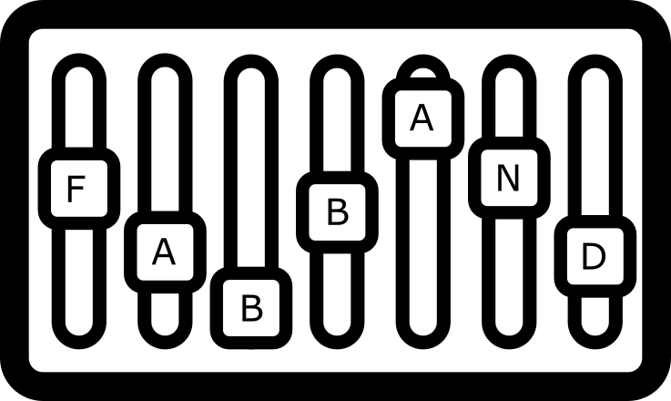

  

[GUI](Documentation/gui/GUI.md) | [Effect Controller](Documentation/effectcontroller/EFFECT_CONTROLLER.md) | [Deployed GUI](http://mcp.miguel-franken.com/) | [Development](Documentation/development/DEVELOPMENT.md)
 [Deployment](Documentation/DEPLOYMENT.md) | [Client](Documentation/CLIENT.md) | [API Documentation](Documentation/API.md) | [Pi Case](Documentation/picase/picase.md)

# The Mix
The Mix receives control messages wirelessly from the instruments and produces sound output. It runs on a separate device that can be connected to quality loudspeakers. Using your phone or tablet, you can connect to the device and open a GUI to control the Mix.

## Getting started
Typically, the Mix will run on a [Raspberry Pi]. The [Pi] will create a WiFi hotspot to which instruments and devices can connect, and set its own IP so that it is easily reachable. Once inside the [Pi]'s network, you can open the GUI by connecting to its IP on a specific port.

You can also run the Mix on your own machine. Be aware that you might need to modify the instruments such that they connect to your machine instead. Setup instructions can be found in [DEVELOPMENT.md](Documentation/development/DEVELOPMENT.md).

A final alternative is to use the version hosted at http://mcp.miguel-franken.com/. Again, you would need to ensure that instruments connect to this instance. But it might be the easiest option to simply try out the [local instruments](#local-instruments).

[Raspberry Pi]: https://www.raspberrypi.org/
[Pi]: https://www.raspberrypi.org/
